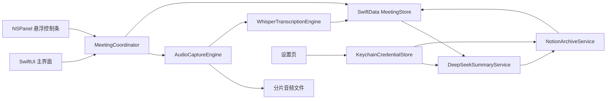
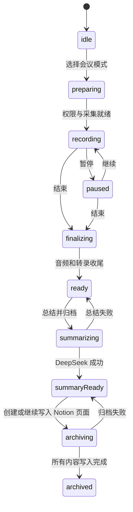

# Apple Silicon 原生会议记录 App 设计

- 日期：2026-07-13
- 状态：已批准
- 平台：macOS 15 及以上，仅支持 Apple Silicon（arm64）

## 1. 目标

构建一款极简的原生 macOS 会议记录 App，支持：

- 线下会议：采集麦克风音频。
- 在线会议：同时采集系统音频与麦克风音频，不保存屏幕画面。
- 使用本地 WhisperKit 在 Apple Silicon 上进行近实时转录。
- 录音期间显示始终置顶的悬浮控制条，且仅包含录音、暂停、结束和书签四个图标。
- 点击一次“总结并归档”，使用 DeepSeek 生成结构化总结，并在用户指定的 Notion 父页面下创建会议子页面。
- 在设置中保存、测试和替换 DeepSeek API Key 与 Notion Token。
- 在网络失败、应用崩溃或外部服务失败时保留本地会议数据并支持恢复。

## 2. 非目标

第一版不包含：

- 说话人识别或自动区分发言人。
- 多人实时协作。
- 日历、邮件或通讯录集成。
- iPhone、iPad 或 Intel Mac 支持。
- 云同步或跨设备同步。
- 自动加入在线会议。
- 屏幕视频录制。

数据模型会为未来增加说话人字段保留扩展空间，但第一版不实现该能力。

## 3. 技术路线决策

### 3.1 采用的方案

采用原生 SwiftUI、AppKit、ScreenCaptureKit、AVFoundation、SwiftData、Security/Keychain 与 WhisperKit：

- SwiftUI 构建主窗口与设置界面。
- AppKit `NSPanel` 构建始终置顶的极简悬浮录音条。
- AVFoundation 采集线下会议的麦克风音频。
- ScreenCaptureKit 在在线会议模式下同时采集系统音频与麦克风音频。
- WhisperKit 使用 Core ML 在本机完成语音转录。
- SwiftData 保存会议、转录片段、书签、总结与归档状态。
- Keychain 保存 DeepSeek API Key 与 Notion Token。
- URLSession 调用 DeepSeek 和 Notion REST API。

### 3.2 未采用的方案

1. Apple Speech：依赖最少，但不同语言、系统和网络环境下的离线能力与长会议行为不够可控。
2. 云端 ASR：需要额外服务与费用，并需要上传原始会议音频，不符合隐私优先目标。
3. 非原生桌面框架：会增加运行时体积和系统集成成本，不符合 Apple Silicon 原生架构目标。

## 4. 产品与界面设计

### 4.1 主窗口

主窗口采用原生双栏布局：

- 左栏：全部会议列表，显示标题、日期、时长、会议类型和归档状态。
- 右栏：所选会议详情，显示音频播放、转录、书签、总结和 Notion 状态。
- 首页提供“线下会议”和“在线会议”两个主要入口。
- 会议结束后自动打开会议详情。
- 会议结束前不自动调用付费接口。
- 详情页的主要操作是“总结并归档”。

### 4.2 悬浮录音条

悬浮录音条由无标题、始终置顶的 `NSPanel` 承载，并使用 macOS 半透明材质。面板严格只显示四个图标：

1. 录音。
2. 暂停；暂停后再次点击即继续。
3. 结束。
4. 书签。

面板不显示标题、计时器、波形、转录内容或文本标签。当前状态通过图标颜色、填充和禁用状态表达。面板可拖动，记住上次位置，并保持在 Spaces 和全屏应用之上。

### 4.3 设置页

设置页包含：

**DeepSeek**

- API Key 密码输入框。
- 模型选择框；测试成功后用 `/models` 返回值更新可用模型。
- “测试连接”按钮。
- 连接状态及错误说明。

**Notion**

- Notion Token 密码输入框。
- 目标父页面链接输入框。
- “测试连接”按钮。
- 成功时显示识别到的父页面标题。

**凭据管理**

- “保存设置”按钮将敏感凭据写入 Keychain。
- 已保存凭据仅显示存在状态和末尾四位，不把完整值放回普通界面状态。
- 替换操作覆盖旧 Keychain 项目。
- 清除操作永久删除对应 Keychain 项目。
- Notion 页面链接和模型名称等非敏感设置保存在 App 设置中。

### 4.4 视觉与可访问性

- 使用系统字体、原生材质和有限的强调色。
- 支持浅色与深色模式。
- 支持键盘导航和 VoiceOver。
- 不加入装饰性动画。
- 错误反馈使用就地状态与可执行提示，不依赖难以追踪的临时弹窗。

## 5. 系统架构

### 5.1 AppShell

负责主窗口、设置窗口、导航、命令菜单和 App 生命周期。启动时检查未完成的录音会话并触发恢复流程。

### 5.2 MeetingCoordinator

作为录音状态机的唯一写入者，协调权限、采集、转录、书签、悬浮面板和持久化。使用 Swift actor 或等效串行隔离，防止重复开始、重复结束和暂停竞争。

### 5.3 AudioCaptureEngine

暴露统一接口，但内部有两种采集策略：

- `MicrophoneCaptureSource`：AVFoundation/AVAudioEngine 麦克风输入。
- `SystemAndMicrophoneCaptureSource`：ScreenCaptureKit 的 `.audio` 与 `.microphone` 输出。

在线模式对齐两路样本时间戳，重采样后混合为转录输入。App 排除自身音频，避免提示音回录。屏幕帧不写入文件。

### 5.4 SegmentedAudioWriter

持续将音频写为短分片，以降低异常退出时的损失：

- 每个已完成分片独立可读。
- 保存分片清单、起止时间与校验状态。
- 正常结束后生成可连续播放的会议音频表示。
- 恢复流程忽略未完成的尾部分片，并保留此前有效内容。

### 5.5 WhisperTranscriptionEngine

- 首次使用时下载适合当前设备资源的 WhisperKit 模型。
- 下载显示进度并支持恢复。
- 音频采集不依赖模型已就绪；模型未就绪时先保存音频，稍后补转录。
- 转录结果以带起止时间的片段持续写入 SwiftData。
- 临时结果可在界面展示，只有最终结果进入持久化文本。
- 录音结束后完成剩余队列，再把会议标记为可总结。

### 5.6 MeetingStore

通过 SwiftData 保存领域数据，并封装查询、自动保存、迁移与删除。大体积音频保存在 App 沙盒文件目录中，数据库只保存受控相对路径。

### 5.7 DeepSeekSummaryService

- 使用用户保存的 API Key 和可配置模型。
- “测试连接”调用 `GET /models`，验证凭据并更新模型列表，不产生总结生成费用。
- 总结调用 Chat Completions，并要求 JSON 结构化输出。
- 结果字段包括建议标题、摘要、关键结论、决定事项、行动项和书签洞察。
- 对过长输入使用分段摘要再汇总，避免依赖单一模型的上下文上限。
- 验证 HTTP 状态、`finish_reason` 和 JSON 结构后才保存总结。

### 5.8 NotionArchiveService

- 从用户链接中规范化并提取父页面 ID。
- 测试连接时先验证 Token，再读取父页面并返回页面标题。
- 归档时在父页面下创建独立会议子页面。
- 创建成功后立即保存 Notion page ID 与 URL。
- 按官方限制将长文本切分为不超过 2000 字符的 rich text，并按批次追加 blocks。
- 保存追加进度；失败重试时继续写同一页面，不创建重复页面。

### 5.9 KeychainCredentialStore

封装 Keychain 的保存、读取、替换和删除。Keychain service 使用固定 App 标识，DeepSeek 与 Notion 使用不同 account。敏感值不进入 SwiftData、UserDefaults、普通日志或崩溃上下文。

## 6. 录音状态与数据流

### 6.1 开始

1. 用户选择线下或在线会议。
2. App 检查系统与模型状态、磁盘空间和所需权限。
3. 建立本地 MeetingSession，并立即保存。
4. 启动采集和音频写入。
5. 显示悬浮录音条。

### 6.2 录音中

- 音频一份进入分片写入器，一份进入转录队列。
- 转录结果以时间片段持续保存。
- 点击书签只记录当前有效音频时间，不弹出输入框。
- 详情页突出书签前后约 30 秒的转录内容。
- 暂停期间不写入音频；恢复后有效音频时间轴保持连续，不插入静音空白。

### 6.3 结束

1. 停止接收新样本。
2. 完成当前音频分片。
3. 完成转录队列或记录待补转录片段。
4. 隐藏悬浮录音条。
5. 打开会议详情并将状态设为 `ready`。

### 6.4 总结并归档

1. 验证本地最终转录和 DeepSeek 配置。
2. DeepSeek 生成并返回结构化总结。
3. 本地保存总结；可用建议主题更新默认会议标题。
4. 验证 Notion 配置。
5. 创建或继续目标子页面。
6. 按以下顺序写入：会议元信息、摘要、关键结论、决定事项、行动项、书签摘录、完整转录。
7. 保存 Notion URL 和归档完成状态。

## 7. 数据模型

### 7.1 MeetingSession

- `id`
- `title`
- `mode`：offline/online
- `state`
- `startedAt`、`endedAt`
- `activeDuration`
- `audioManifestPath`
- `createdAt`、`updatedAt`
- `suggestedTitle`
- `summaryStatus`
- `archiveStatus`
- `notionPageID`、`notionPageURL`
- `lastErrorCode`

### 7.2 TranscriptSegment

- `id`
- `meetingID`
- `startTime`、`endTime`
- `text`
- `isFinal`
- `speakerID`：第一版为空，为未来扩展保留
- `sourceRevision`

### 7.3 Bookmark

- `id`
- `meetingID`
- `timestamp`
- `createdAt`

### 7.4 MeetingSummary

- `meetingID`
- `overview`
- `keyPoints`
- `decisions`
- `actionItems`
- `bookmarkInsights`
- `model`
- `createdAt`

### 7.5 ArchiveCheckpoint

- `meetingID`
- `notionPageID`
- `nextSection`
- `nextBatchIndex`
- `updatedAt`

## 8. 权限、隐私与安全

- 线下模式仅请求麦克风权限。
- 在线模式请求麦克风和屏幕/系统音频录制权限。
- 权限拒绝时不进入假录音状态；界面说明缺失权限并提供打开系统设置入口。
- 第一次录音前提示用户确认已获得参会者录音许可。
- 原始音频始终留在本机，不发送给 DeepSeek 或 Notion。
- 只有用户点击“总结并归档”后，转录文本、会议元数据和书签上下文才发送给 DeepSeek。
- 总结、书签摘录和完整转录随后发送给用户配置的 Notion 页面。
- 日志过滤 Authorization 请求头、Key、Token、完整转录和音频内容。
- 删除会议时删除本地音频、转录、书签和总结；不自动删除已归档的 Notion 页面。

## 9. 错误与恢复

### 9.1 启动与权限

- 不支持的 Mac 或系统版本：显示明确要求并停止录音功能。
- 磁盘空间不足：开始前阻止录音，录音中进入安全停止流程。
- 权限拒绝：指出具体权限和修复路径。
- 模型缺失：允许先录音，完成后等待模型并补转录。

### 9.2 录音与转录

- 单个转录片段失败不终止录音。
- 失败片段保留源音频范围并支持重新转录。
- 异常退出后扫描未完成 session 和分片清单，恢复已完成音频、文本和书签。
- 恢复后由用户选择继续处理或结束会议，不伪造仍在进行的采集状态。

### 9.3 DeepSeek

- 区分无效 Key、网络离线、超时、限流、服务错误、输出截断和 JSON 无效。
- 自动重试至多一次，之后由用户手动重试，避免重复计费。
- 总结失败不修改或删除本地转录。

### 9.4 Notion

- 区分 Token 无效、父页面不存在、未授权访问、请求限流和内容校验错误。
- DeepSeek 成功但 Notion 失败时保留本地总结并显示“重试归档”。
- 已有 page ID 时只继续写入该页面。
- 批次成功后更新 ArchiveCheckpoint，保证重试幂等。

## 10. 测试策略

### 10.1 单元测试

- 录音状态机的合法与非法转换。
- 暂停后有效时间轴计算。
- 书签时间戳与转录窗口选择。
- Notion 页面链接解析和 ID 规范化。
- Notion 2000 字符切分、block 批处理与 checkpoint。
- DeepSeek JSON 解码、缺失字段、截断和错误映射。
- Keychain 保存、替换、删除与遮挡展示逻辑。
- 会话删除和文件清理策略。

### 10.2 集成测试

- 使用合成音频缓冲测试采集到分片写入流程。
- 使用固定音频 fixture 测试 Whisper 转录适配层。
- 使用 URLProtocol stub 测试 DeepSeek 和 Notion 的成功、失败、限流与重试。
- 使用临时 SwiftData store 测试崩溃恢复和归档 checkpoint。
- 验证日志脱敏。

### 10.3 UI 测试

- 首页两种会议入口。
- 悬浮条始终只有四个控制项。
- 录音、暂停、继续、书签和结束的状态反馈。
- 设置页凭据保存、清除和连接测试状态。
- 总结并归档按钮的防重复点击与阶段进度。
- VoiceOver 标签和键盘操作。

### 10.4 真机端到端测试

在 Apple Silicon Mac 上验证：

- 麦克风线下录音。
- 在线会议系统声音与麦克风同时录制。
- 一小时录音不中断，界面保持响应，转录积压不会阻塞采集。
- 暂停、继续、书签与结束。
- 模型首次下载和恢复。
- App 异常终止后的会话恢复。
- 真实 DeepSeek Key 的测试连接与总结。
- 真实 Notion Token、父页面测试和完整归档。

## 11. 验收标准

1. Release 构建为原生 arm64，并能在 macOS 15+ Apple Silicon Mac 上运行。
2. 线下模式能录制麦克风并生成带时间戳的本地转录。
3. 在线模式能同时记录系统声音与麦克风，不保存屏幕视频。
4. 悬浮条只显示录音、暂停、结束和书签四个图标。
5. 暂停、继续、结束和书签行为与有效音频时间轴一致。
6. 一小时录音不会因转录积压而中断，主界面保持响应。
7. 异常退出后能恢复已落盘的音频、文本和书签。
8. DeepSeek 能生成结构化总结，失败不会破坏本地会议。
9. Notion 能在指定父页面下创建无重复的会议子页面，并写入全部规定内容。
10. DeepSeek Key 与 Notion Token 安全保存在 Keychain，重启后仍可用。
11. 两个测试连接按钮能显示成功或具体失败原因。
12. 密钥、完整转录和音频不会出现在普通日志或崩溃日志中。
13. 自动化测试与 Apple Silicon 真机端到端测试通过。

## 12. 官方技术依据

- Apple ScreenCaptureKit：<https://developer.apple.com/documentation/screencapturekit/capturing-screen-content-in-macos>
- Apple Speech 与本地识别说明：<https://developer.apple.com/documentation/speech/sfspeechrecognizer/supportsondevicerecognition>
- WhisperKit/Argmax OSS：<https://github.com/argmaxinc/argmax-oss-swift>
- DeepSeek Chat Completion：<https://api-docs.deepseek.com/api/create-chat-completion>
- DeepSeek Lists Models：<https://api-docs.deepseek.com/api/list-models>
- Notion Create a Page：<https://developers.notion.com/reference/post-page>
- Notion Retrieve a Page：<https://developers.notion.com/reference/retrieve-a-page>
- Notion Append Block Children：<https://developers.notion.com/reference/patch-block-children>
- Notion Request Limits：<https://developers.notion.com/reference/request-limits>
